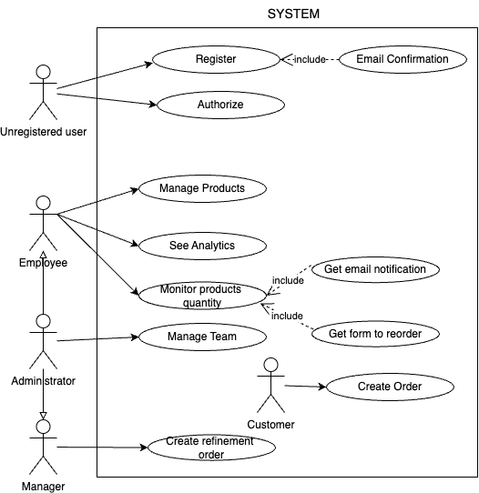
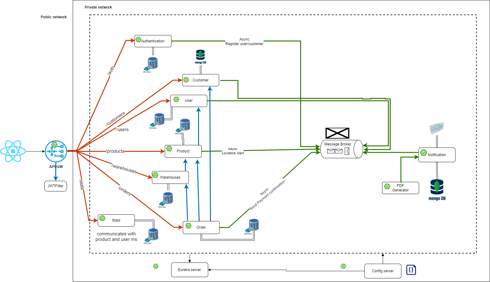
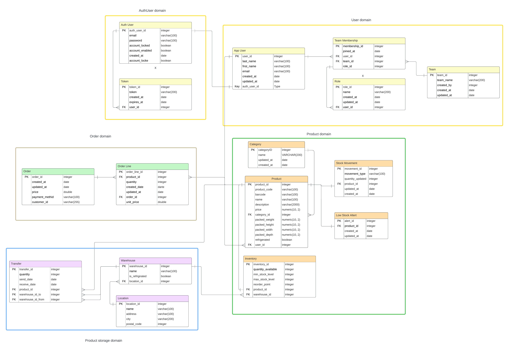
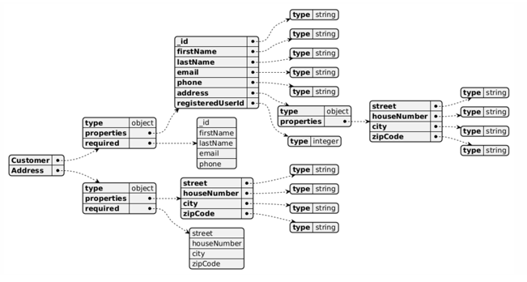
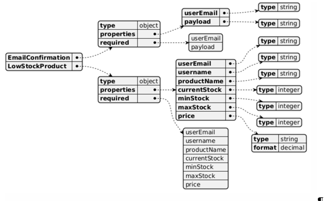
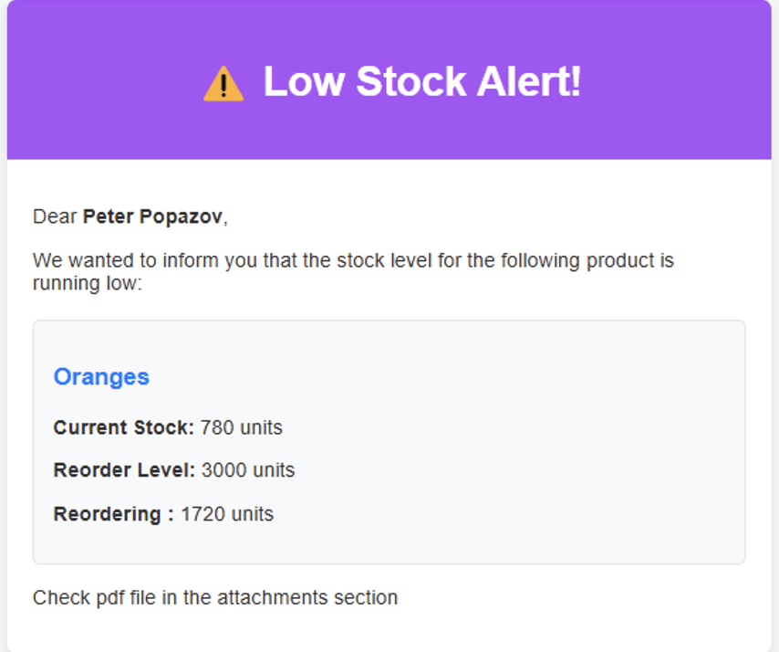

# Inventory Management System

## Abstract:
The coursework presents the development of a system for efficient warehouse stock management. The primary goal is to enable users to monitor inventory levels, receive low-stock alerts, analyze product movement, and generate statistical reports to streamline business processes.

## Technical Highlights:
* Architecture: Microservice-based, implemented with Spring Boot.
* Databases: PostgreSQL and MongoDB for robust and scalable data storage.
* Communication: Apache Kafka, HTTP requests
* Frontend: React and Tailwind CSS for a responsive and user-friendly interface.
* Development Focus: REST API design, database integration, notification system setup, and testing.

## Outcomes:
* Developed features include adding/editing product and warehouse data, tracking inventory movements, automated low-stock alerts via email, and generating detailed statistical reports.
* Optimized for industries like retail, logistics, manufacturing, and e-commerce.

## Use Case Diagram

## Logical View

## Data View

### Relational ER-diagram

### Document Oriented Diagrams

## Preview

### Low Stock alert
The notification that the user receives when the quantity of the corresponding product has fallen below the corresponding value. The notification is sent to the user at the e-mail address specified during registration.

### Reorder form
The form generated by the system user when the quantity of the corresponding product has fallen below the corresponding value. The user can independently order this form, on the "Notifications" page, by clicking on the appropriate button. The notification is sent to the user at the e-mail address specified during registration.

